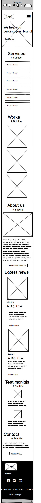

# 0x06. Responsive design

### Welcome!

This is a responsive design from the Techium project I've been working on during the Web Stack programming specialization at Holberton School.

------

### Resources

- [The building blocks of responsive design - Progressive web apps | MDN](https://intranet.hbtn.io/rltoken/xunPO8dNZy0mJpq8vbUMRA)
- [A pragmatic guide to designing and building responsive web applications | developerlife.com](https://intranet.hbtn.io/rltoken/rs5zCrDpRaU6LD13-rG2yg)
- [Understanding the difference between mobile-first, adaptive and responsive design](https://intranet.hbtn.io/rltoken/7W08yfp6vBGFlgoqZZc7eQ)
- [LukeW | Mobile First](https://intranet.hbtn.io/rltoken/AMTqHMY4OeGET3nOdRH2uQ)
- [Media Queries | A collection of inspirational websites using media queries and responsive web design](https://intranet.hbtn.io/rltoken/bk52ihWug_pe0QUghl99aQ)
- [Responsive Design Newsletter](https://intranet.hbtn.io/rltoken/2-TtEUGzh46dBxQ1VJ7ksg)

------

### Learning Objectives

- Mobile-first design
- Media-queries
- Sizes to use for responsive web design
- How to make a website responsive
- The differences between responsive and adaptive design
- CSS units that are used to make elements flexible

------

### Wireframe of the Techium project - mobile version

